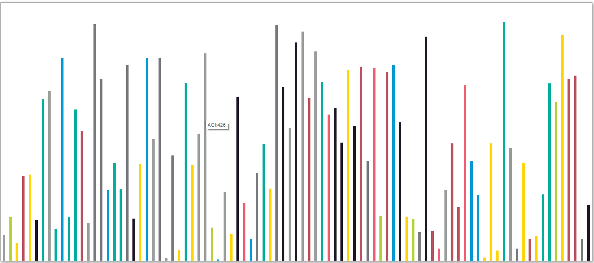

Baidu IFE 2016
=============
Task 1-6不知道说什么，居中的那个实现方法比较多，尤其是一些hack方法，知道了Flex之后发现真神奇，居中也更方便。

Task 7
======
常见的产品官网
整个container加上个min-width就可以不用太考虑适应性的问题了。
这是[Rank1](https://github.com/chenBuJuan/IFE-FirstStage-Task7)的代码，个人感觉细节做的很好。其中用**纯CSS**做了个轮播图，我在Task 12中使用这个方法却出现了优先级的问题，所以这里我一直有疑问（待解决）。

Task 8
======
一个类似Bootstrap的响应式（栅格化）布局。
做法也是直接给DOM加类名（比如col-md-4/col-sm-8），然后用CSS里的媒体查询。
PS：calc很好用

Task 9
======
一个常见的后台管理系统的模板吧
没什么难度，就是花时间（技艺不精的借口233），其中Table的一些默认属性的坑踩一踩，还有-webkit-appearance这个可能用的比较多。话说这个task的CSS写了1K行，还没学SASS和LESS。

Task 10
======
之前都是写盒模型的。Flex第一眼看上去的确很惊艳。相比盒模型有些api爽到飞起，但是感觉又不如盒模型那样细致，不太敢用的感觉。
但是好像在移动设备上有很大的兼容问题。在以后的项目中用flex试试，尽量取其精华。

Task 11
=======
说好的不用JS，rank前几都用了（手动斜眼.jpg）。
这个我没做，好吧就是懒了

Task 12
=======
CSS的特性
第一个是nth-child()和nth-of-type()这样的选择器就可以
第二个transition动画
第三个就是前面task 7的遗留问题，(!important && js)都不可以用的痛。


*终于弃了几个第一阶段的坑，到了Js的部分。*

Task 13
=======
看起来挺简单，实现也不难。
但是看了[Rank1](https://github.com/jshacker007/ife2016/blob/master/stage2/task13/index.html)的代码，感觉还是native，主要就是下面这几个方面
- 二次封装(不知道有没有这个词)，比如jq的$，原因么，写起来方便。
- 兼容性，除了click事件包括了keyup。
- 数值转换，已经有效数据判断。
健壮性很强，值得学习。

Task 14
=======
比较简单，基本上sort加个if就可以了。
在[Rank2](https://github.com/jshacker007/ife2016/blob/master/stage2/task14/index2.html)的代码中发现差不多可以一两行就解决，主要是
- array.filter()
- array.sort()
- array.forEach()

这三个方法及其中的参数。

Task 15
=======
也没什么难度，只不过做的时候闭包出现了点问题。
抽象函数的形式值得学习
在[Rank10](https://github.com/jshacker007/ife2016/blob/master/stage2/task15/index1.html)的代码中发现了更具兼容的代码

``` JavaScript
data.push(new Array(
  str.substring(0,str.indexOf("空气质量")),                             //get the city name
  parseInt(str.substring(str.indexOf("<b>")+3, str.indexOf("</b>")))    //get the city dqi score
  ));
```

我在这里是substr直接按位截取的，坏处都懂。

Task 16
=======
难度也不大，正则用起来很爽。事件监听的用事件委托，可以解决用js后添加进去的DOM节点选不到的问题
``` javascript
var parent=document.getElementById(parentNode);
parent.addEventListener(type,fun);
function fun(e){
  if (e.target.nodeName==="LI"){
    //do  something
  }
}
```
正则那里我最开始是```/[\u4e00-\u9fa5]+|[a-zA-Z]+/g```取汉字和字母的每一串，然后聚合为一串再与源字符串比较。
看了[Rank2](https://github.com/soulclearm/Learn_front_end/blob/dev/public/second/script/task16.js)发现可以直接判断返回的数组或者NULL。它的正则是```/^[\u4e00-\u9fa5a-zA-Z]+$/g```

Task 17
======
一个用js做的数据可视化？基本的架构逻辑已经给出了，主要就是填写细节。方法也应该不少，虽然我的方法比较浪费资源，day/week/month的数据重复项很多，但是好处是后期判断并可视化处理的地方就比较方便了（但是感觉保证数据不重复，而且简洁处理的方法也是有的）。处理数据的地方写的太丑。对于感觉可能存在的属性或者方法该Google还得Google，该查MDN还得查

布局用的Flex，非常方便。

还有点没处理完就是没动画，不知道哪里出了BUG（或者是哪里理解有问题），添加的动画一直没有效果。

Task 18
======
比较简单。实现一个特定的数据结构吧，中间带几个DOM操作。
本来我最开始强行抽象，但是发现只有两句话的函数太多了，就没必要了。

Task 19
======
最近复习汇编，忘了代码过程了，好像也挺简单的。依旧flex

Task 20
======
也挺简单的，主要在考察正则的使用？分割字符的时候我按照需求把回车，逗号（全角半角均可），顿号，空格（全角半角、Tab等）等一个一个写出来了`/\n|,|，|、| |   | /g`

但是看了[Rank1](https://github.com/soulclearm/Learn_front_end/blob/dev/public/second/task20.html#L46)的正则用的方法是除了正常输入都去掉了：`[^0-9a-zA-Z\u4e00-\u9fa5]+/`

另外Rank1几个API用的很好，`querySelect`,`concat`,`split`,`fliter`,`map`,`join`等，我写的太暴力了，总是想不起标准库的方法属性。（为什么你们那么熟练啊.jpg）